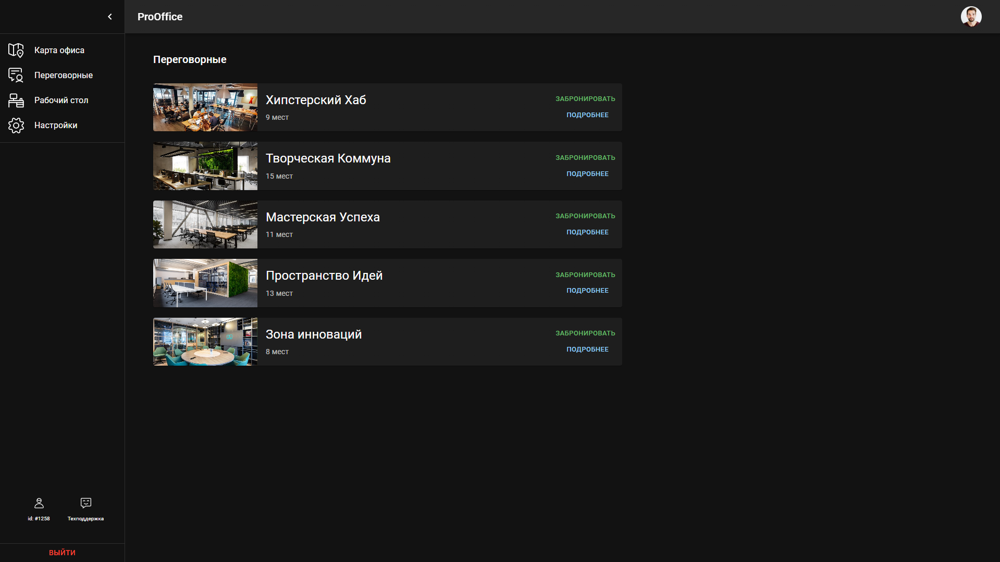
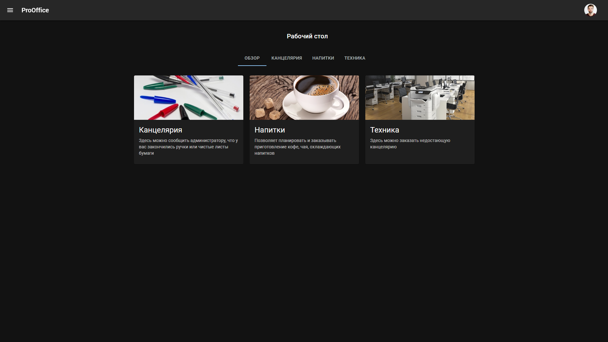
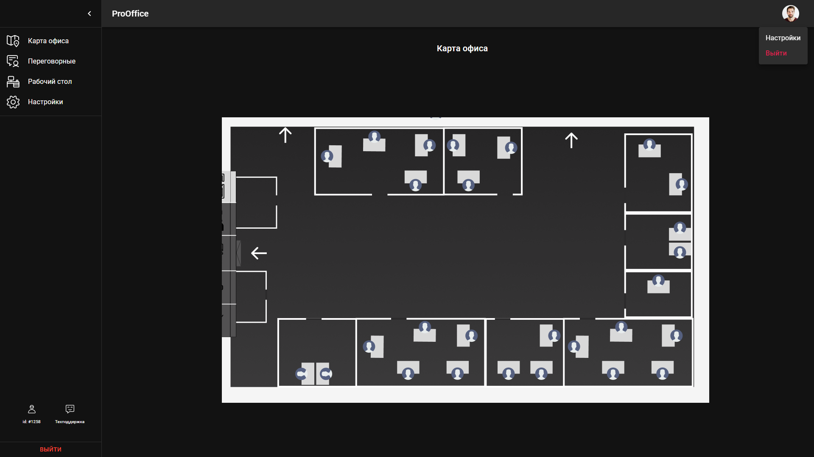

# Pro Office

# Описание
Pro Office - это веб-приложение, призванное сократить расходы офисов. Прежде всего, сократить времязатраты работников на бытовые проблемы с помощью автоматизации и упрощения их решения

Фичи:
* Удобный сервис, позволяющий работникам в пару кликов отправлять запрос на пополнение канцелярских принадлежностей
* Статусы работников внутри сайта(будь то больничный или банальный уход на обед)
* Бронирование переговорных
* Автоматический климат-контроль
* Автоматическое отключение рабочего места, если работник забыл его отключить

# Запуск

Приложение состоит из двух дочерних приложений - фронтенда (`/front`) и бэкенда (`/backend`), поэтому для его работы необходимо запустить одновременно два процесса. Указанные ниже действия выполняются из соответствующих директорий.

Кроме того, потребуется некоторым образом сконфигурировать базу данных.

- имя базы данных: ***smartoffice***
- имя пользователя: ***postgres*** (стандартный)
- пароль: ***psql***
- порт: ***5432*** (стандартный)

Либо Вы можете изменить какие-то данные в файле `/backend/db.py`

## Запуск фронтенда

1. Для установки зависимостей проекта открываем корневой каталог проекта (где лежит файл package.json) и выполняем команду:

```
yarn install
```

2. Запускаем проект:

```
yarn dev
```

3.  Приложение (фронтенд) доступно в браузере по адресу `http://127.0.0.1:5000/`

## Запуск бэкенда

1. Установите зависимости 

```
pip install -r requirements.txt
```

2. Запустите командой

```
python funcs.py
```

3. Бэкенд доступен на порту 5001

***!!! Рекомендуется использовать виртуальное окружение (используйте, например, библиотеку `venv`), чтобы зависимости не устанавливались глобально.***

# Стек технологий

* ReactJS + MUI (Javascript) - фронтенд

* Flask (Python) - бэкенд

* PostgreSQL - база данных


# Внешний вид сайта

**Рабочий стол**



**Переговорные**



**Карта офиса**


